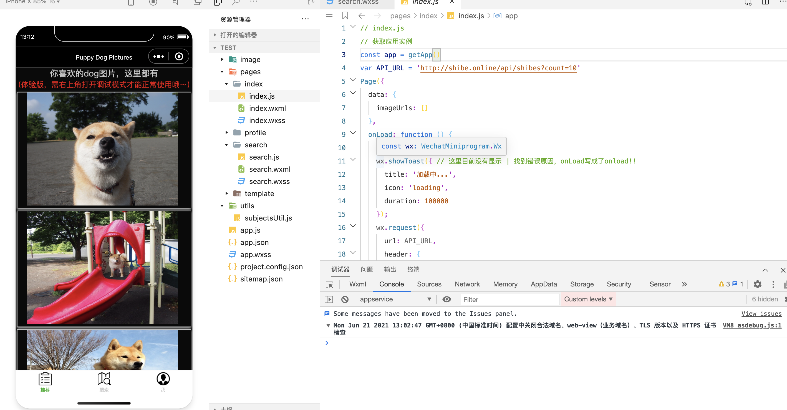
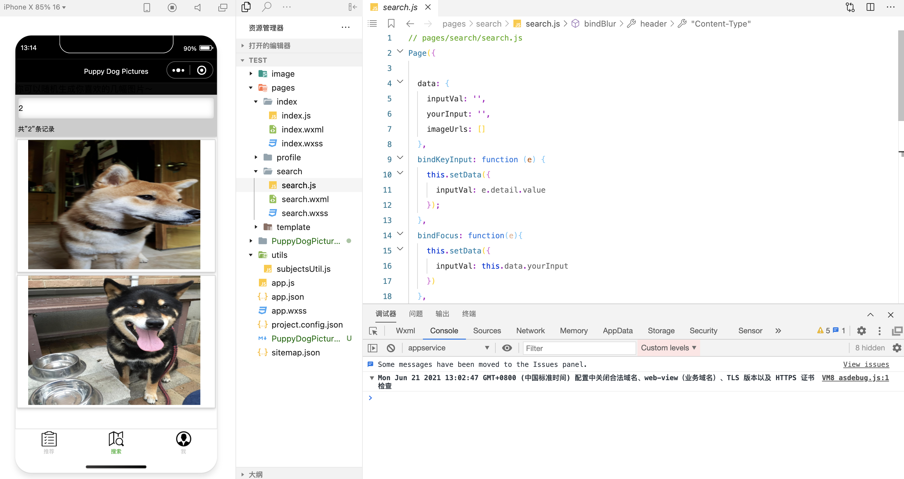

# PuppyDogPictures

## 介绍

​	利用[api](https://shibe.online)随机生成狗狗图片的微信小程序，简单的微信小程序上手项目～

​	对应博客地址：[这里](https://jason-qianhao.github.io/_posts/2021-06-21-微信小程序入门之PuppyDogPitures/)

## 系统设计

​	小程序有3个页面：

- 主页，随机推荐的10张狗狗图片
- 搜索页，可以输入想要的狗狗图片数量，自动生成相应数量的狗狗图片
- 个人页，简单的介绍

## 页面和项目展示

